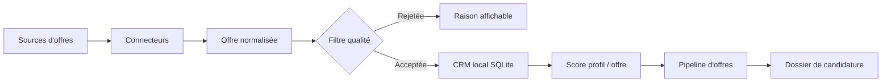

<h1 align="center">Juste Recrute Moi</h1>

<p align="center">
  <strong>Agrégateur local-first d'offres d'emploi pour le marché français.</strong>
</p>

<p align="center">
  <a href="LICENSE"></a>
  
  
  
  
</p>

<p align="center">
  <a href="#objectif">Objectif</a>
  &middot;
  <a href="#sources-demploi">Sources</a>
  &middot;
  <a href="#fonctionnement">Fonctionnement</a>
  &middot;
  <a href="#installation-développement">Installation</a>
  &middot;
  <a href="#licence-et-attribution">Licence</a>
</p>

---

## Objectif

Juste Recrute Moi part d'un fork de JustHireMe pour créer un **vrai agrégateur gratuit d'offres d'emploi en France**. L'application récupère des offres depuis plusieurs sources, les normalise, filtre les lignes faibles, déduplique les doublons, puis les classe dans un pipeline local.

Le produit vise d'abord la recherche d'emploi, pas l'automatisation aveugle des candidatures. Les données du profil, les offres, les scores et les documents générés restent stockés localement par défaut.

## Statut actuel

| Zone | État |
| --- | --- |
| Application desktop Tauri + React | Fonctionnelle |
| Backend Python FastAPI | Fonctionnel |
| Agrégation France Travail | Branchée, source stable avec identifiants API |
| JobSpy pour Indeed / Google Jobs | Branché en best effort |
| ATS directs | Greenhouse, Lever, Ashby, Workable, SmartRecruiters, Teamtailor |
| Import d'URL | JSON-LD `JobPosting` puis extraction HTML de secours |
| Déduplication et quality gate | Branchées sur le pipeline existant |
| Scoring et génération de dossiers | Hérités du socle local-first |
| Auto-apply navigateur | Expérimental, désactivé par défaut |

## Sources D'Emploi

### Sources prioritaires

- **France Travail API** : source stable pour le marché français. Elle nécessite `FRANCE_TRAVAIL_CLIENT_ID` et `FRANCE_TRAVAIL_CLIENT_SECRET`.
- **ATS directs** : Greenhouse, Lever, Ashby, Workable, SmartRecruiters et Teamtailor. Ces sources sont à privilégier quand une entreprise publie ses offres directement sur un ATS.
- **Import URL** : utile pour ajouter manuellement une offre WTTJ, HelloWork, LinkedIn, Indeed ou une page carrière qui expose du JSON-LD.

### Sources best effort

- **JobSpy** : peut interroger Indeed et Google Jobs sans API commerciale obligatoire, mais les résultats dépendent des limites des sites et peuvent varier.
- **Requêtes `site:`** : utiles pour explorer WTTJ, HelloWork ou d'autres jobboards, mais elles ne remplacent pas un vrai connecteur stable.

Le projet évite volontairement les dépendances payantes obligatoires : pas de proxy payant, pas d'Apify payant imposé, pas d'API commerciale requise pour la v1.

## Fonctionnement



Les connecteurs convertissent chaque offre vers un modèle commun, puis le pipeline existant applique :

- une URL canonique pour dédupliquer les offres ;
- une quality gate pour éviter les offres trop pauvres, obsolètes ou peu fiables ;
- un score de pertinence par rapport au profil ;
- des badges de fiabilité source : stable, manuel ou à vérifier.

## Architecture

| Zone | Technologie |
| --- | --- |
| App desktop | Tauri 2 |
| Frontend | React, TypeScript, Vite |
| Backend | Python 3.13, FastAPI |
| Stockage local | SQLite |
| Graphe profil | Kuzu |
| Recherche vectorielle | LanceDB + modèle ONNX local |
| Génération de documents | Markdown / PDF |

La structure principale du repo :

```text
Juste Recrute Moi/
|-- src/                 Interface React
|-- backend/             API locale, discovery, ranking, génération
|-- backend/discovery/   Connecteurs et normalisation des offres
|-- src-tauri/           Shell desktop Tauri
|-- docs/                Architecture, sources, release, conformité
|-- website/             Site public
|-- scripts/             Scripts de build et smoke tests
```

## Installation Développement

Prérequis :

| Outil | Version |
| --- | --- |
| Node.js | 24 recommandé |
| Python | 3.13+ |
| Rust | stable |
| uv | dernière version stable |
| pnpm | 10.33.2, via Corepack ou installation locale |

Installation :

```bash
git clone https://github.com/ValMtp3/Juste-Recrute-Moi.git
cd "Juste-Recrute-Moi"
corepack enable
pnpm install
cd backend
uv sync --dev
cd ..
```

Lancer l'interface frontend seule :

```bash
pnpm dev
```

Lancer l'application desktop en développement :

```bash
pnpm dev:local
```

## Configuration

La plupart des réglages passent par l'application. Pour le développement local, copiez `.env.example` vers `.env` uniquement si vous avez besoin de variables d'environnement.

Variables importantes pour le MVP France :

| Variable | Usage |
| --- | --- |
| `FRANCE_TRAVAIL_CLIENT_ID` | Identifiant OAuth France Travail |
| `FRANCE_TRAVAIL_CLIENT_SECRET` | Secret OAuth France Travail |
| `FRANCE_TRAVAIL_SCOPE` | Scope API, valeur par défaut fournie |
| `OLLAMA_URL` | Endpoint local si vous utilisez Ollama |
| `OPENAI_API_KEY`, etc. | Clés optionnelles pour les fournisseurs LLM |

Ne commitez jamais `.env`, des clés API, des cookies, des CV privés, des bases locales ou des documents générés.

## Commandes Utiles

| Tâche | Commande |
| --- | --- |
| TypeScript | `pnpm typecheck` |
| Tests frontend | `pnpm test` |
| Build frontend | `pnpm build` |
| Lint frontend | `pnpm lint` |
| Tests backend | `cd backend && uv run python -m pytest tests -q` |
| Smoke sources live | `pnpm smoke:live-sources` |
| Vérification versions | `pnpm version:check` |

## Documentation

- [Architecture](docs/ARCHITECTURE.md)
- [Contrat des connecteurs de sources](docs/source-adapters.md)
- [MCP local](docs/MCP.md)
- [Sécurité](SECURITY.md)
- [Contribution](CONTRIBUTING.md)
- [Mentions légales](docs/legal/README.md)

## Licence Et Attribution

Juste Recrute Moi est distribué sous [GNU Affero General Public License v3.0 only](LICENSE).

Ce dépôt est un fork de JustHireMe. Les notices de copyright et d'attribution conservées dans le code, la licence et `NOTICE` doivent rester présentes conformément à l'AGPL et à l'historique upstream. Les modifications propres à ce fork restent compatibles AGPL si le projet est redistribué ou exposé sur un réseau.

## Feuille De Route Courte

- stabiliser l'onboarding France Travail ;
- remplacer les cibles `site:` fragiles par davantage de connecteurs directs ;
- clarifier les sources France dans l'interface de réglages ;
- ajouter des fixtures par jobboard français ;
- vérifier les builds desktop avant une release publique.
